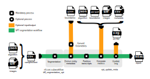

[](https://github.com/WEHI-SODA-Hub/spatialvpt/actions/workflows/ci.yml)
[](https://github.com/WEHI-SODA-Hub/spatialvpt/actions/workflows/linting.yml)[](https://doi.org/10.5281/zenodo.XXXXXXX)
[](https://www.nf-test.com)

[](https://www.nextflow.io/)
[](https://docs.conda.io/en/latest/)
[](https://www.docker.com/)
[](https://sylabs.io/docs/)
[](https://cloud.seqera.io/launch?pipeline=https://github.com/WEHI-SODA-Hub/spatialvpt)

## Introduction

**WEHI-SODA-Hub/spatialvpt** is a bioinformatics pipeline that performs cell segmentation and creates a QC report for MERSCOPE data using the vizgen-postprocessing tool.

<!-- TODO nf-core:
   Complete this sentence with a 2-3 sentence summary of what types of data the pipeline ingests, a brief overview of the
   major pipeline sections and the types of output it produces. You're giving an overview to someone new
   to nf-core here, in 15-20 seconds. For an example, see https://github.com/nf-core/rnaseq/blob/master/README.md#introduction
-->

<!-- TODO nf-core: Include a figure that guides the user through the major workflow steps. Many nf-core
     workflows use the "tube map" design for that. See https://nf-co.re/docs/contributing/design_guidelines#examples for examples.   -->
<!-- TODO nf-core: Fill in short bullet-pointed list of the default steps in the pipeline -->



## Usage

> [!NOTE]
> If you are new to Nextflow and nf-core, please refer to [this page](https://nf-co.re/docs/usage/installation) on how to set-up Nextflow. Make sure to [test your setup](https://nf-co.re/docs/usage/introduction#how-to-run-a-pipeline) with `-profile test` before running the workflow on actual data.

First, prepare a parameters file with your input data that looks as follows:

`params.yml`:

```yaml
sample: "sample_name"
outdir: "/path/to/results"
algorithm_json: "/path/to/algorithm.json"
images_dir: "/path/to/images"
images_regex: "mosaic_(?P<stain>[\\w|-]+)_z(?P<z>[0-9]+).tif"
um_to_mosaic_file: "/path/to/micron_to_mosaic_pixel_transform.csv"
detected_transcripts: "/path/to/detected_transcripts.csv"
update_vzg: true
input_vzg: "/path/to/sample.vzg"
tile_size: 4096
tile_overlap: 400
```

Note that the `algorithm_json` file is temperamental. Check the [Vizgen documentation](https://vizgen.github.io/vizgen-postprocessing/segmentation_options/json_file_format.html) on the requirements.

To run cell segmentation via VPT, you can run the pipeline using:

```bash
nextflow run WEHI-SODA-Hub/spatialvpt \
   -profile <docker/singularity/.../institute> \
   -params-file params.yml \
   --outdir <OUTDIR>
```

If you are running with Apptainer or Singularity, you will have to set the following environmental variable before running the pipeline:

Apptainer:

```bash
export NXF_APPTAINER_HOME_MOUNT=true
nextflow run WEHI-SODA-Hub/spatialvpt \
   -profile apptainer \
   -params-file params.yml \
   --outdir <OUTDIR>
```

Singularity:

```bash
export NXF_SINGULARITY_HOME_MOUNT=true
nextflow run WEHI-SODA-Hub/spatialvpt \
   -profile singularity \
   -params-file params.yml \
   --outdir <OUTDIR>
```

### Custom weights

You can use a custom weights file by specifying the _full path_ in your
parameters file:

```yaml
custom_weights: "/path/to/custom_weights_file"
```

Now you need to add the _file name only_ to your algorithm JSON file, e.g:

```json
"segmentation_properties": {
  "model": "cyto2",
  "model_dimensions": "2D",
  "custom_weights": "custom_weights_file",
  "channel_map": {
    "red": "Cellbound1",
    "green": "Cellbound3",
    "blue": "DAPI"
  }
},
```

### Report options

You can also set extra options for naming channels and filtering by volume and
transcript thresholds when generating reports. See the [VPT documentation](https://vizgen.github.io/vizgen-postprocessing/command_line_interface/index.html#generate-segmentation-metrics)
for more details.

For example:

```yaml
red_stain_name: "Cellbound1"
green_stain_name: "Cellbound2"
blue_stain_name: "DAPI"
transcript_count_threshold: 100
volume_filter_threshold: 200
```

### Report-only mode

If you would like to only generate a QC report, and you already have your metadata,
cell_by_gene and boundary files, you can specify those files in parameters in
your params file:

```yaml
report_only: true
metadata: "/path/to/entity_metadata.csv"
entity_by_gene: "/path/to/entity_by_gene.csv"
boundaries: "/path/to/segmentation.parquet"
```

```bash
nextflow run WEHI-SODA-Hub/spatialvpt \
   -profile <docker/singularity/.../institute> \
   --input params.yml \
   --outdir <OUTDIR>
```

> [!WARNING]
> Please provide pipeline parameters via the CLI or Nextflow `-params-file` option. Custom config files including those provided by the `-c` Nextflow option can be used to provide any configuration _**except for parameters**_;
> see [docs](https://nf-co.re/usage/configuration#custom-configuration-files).

## Credits

WEHI-SODA-Hub/spatialvpt was originally written by Marek Cmero.

We thank the following people for their extensive assistance in the development of this pipeline:

<!-- TODO nf-core: If applicable, make list of people who have also contributed -->

## Contributions and Support

If you would like to contribute to this pipeline, please see the [contributing guidelines](.github/CONTRIBUTING.md).

## Citations

<!-- TODO nf-core: Add citation for pipeline after first release. Uncomment lines below and update Zenodo doi and badge at the top of this file. -->
<!-- If you use WEHI-SODA-Hub/spatialvpt for your analysis, please cite it using the following doi: [10.5281/zenodo.XXXXXX](https://doi.org/10.5281/zenodo.XXXXXX) -->

<!-- TODO nf-core: Add bibliography of tools and data used in your pipeline -->

An extensive list of references for the tools used by the pipeline can be found in the [`CITATIONS.md`](CITATIONS.md) file.

This pipeline uses code and infrastructure developed and maintained by the [nf-core](https://nf-co.re) community, reused here under the [MIT license](https://github.com/nf-core/tools/blob/master/LICENSE).

> **The nf-core framework for community-curated bioinformatics pipelines.**
>
> Philip Ewels, Alexander Peltzer, Sven Fillinger, Harshil Patel, Johannes Alneberg, Andreas Wilm, Maxime Ulysse Garcia, Paolo Di Tommaso & Sven Nahnsen.
>
> _Nat Biotechnol._ 2020 Feb 13. doi: [10.1038/s41587-020-0439-x](https://dx.doi.org/10.1038/s41587-020-0439-x).
